# PHP EC Site

## 概要

PHPで作成した「ECサイト」です。

フレームワークは使用せず、
MVCを意識して設計しました。

顧客向け画面だけでなく、
管理側の機能も実装しています。

セキュリティ、保守性を意識して開発しました。

## デモ画像

必要な画像は「chatGPT」により作成。

メールアドレス、IPアドレスは、一部を消去しています。

### 顧客側

「商品一覧」

未ログイン時は、商品一覧のみ表示します。

ログイン後は、カート機能が利用できます。

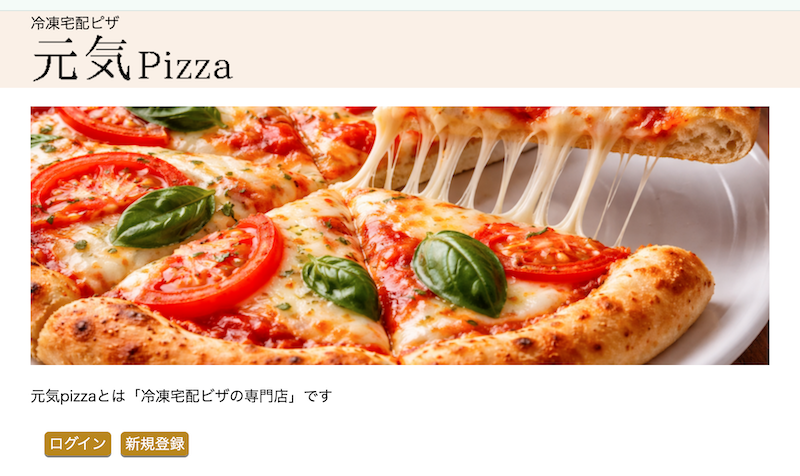

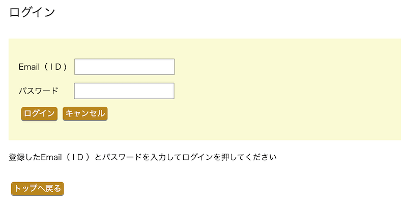
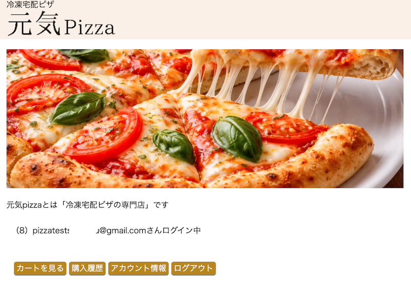
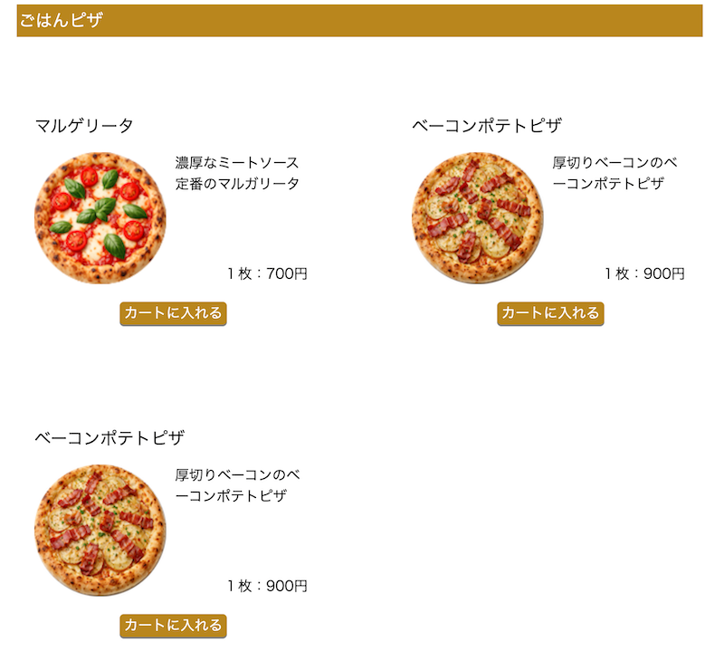
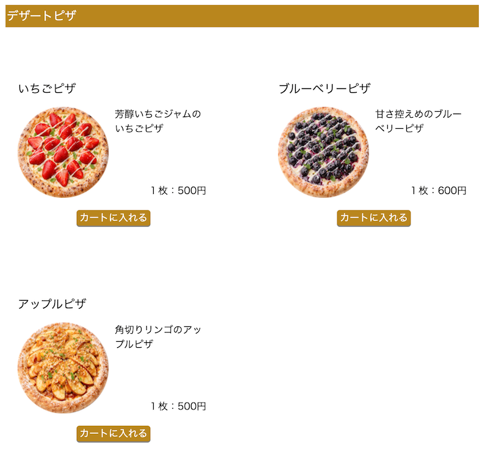
<br><br>
「カート機能」
<br><br>
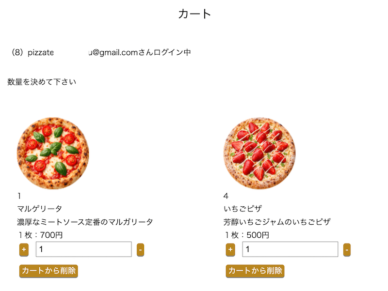
<br><br>
「購入履歴もあります」
<br><br>
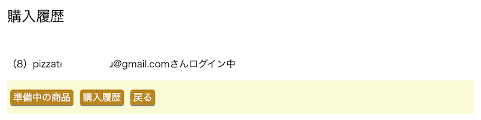

### 管理側

「管理画面」

管理画面は、アカウントを２つに分けています。<br><br>
general＝受注の操作だけ

admin＝全ての操作

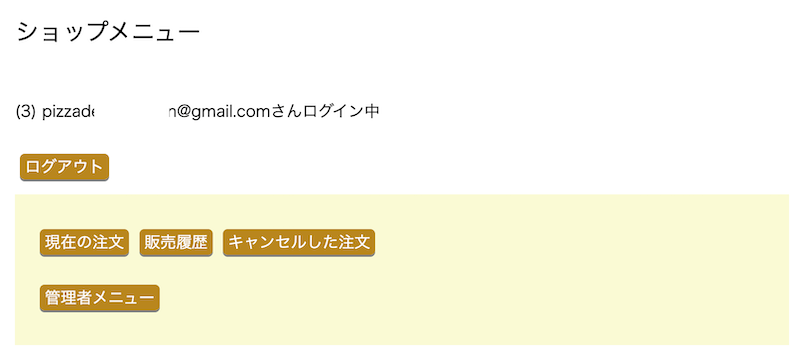

adminは、専用の操作ができます。

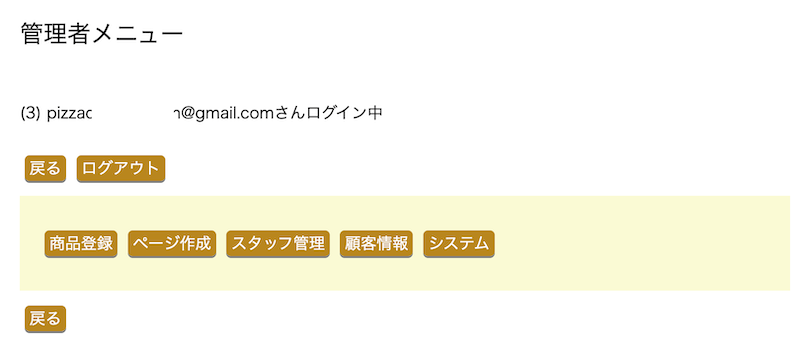
<br><br>
受注画面では、注文ステータスを変えることができます。

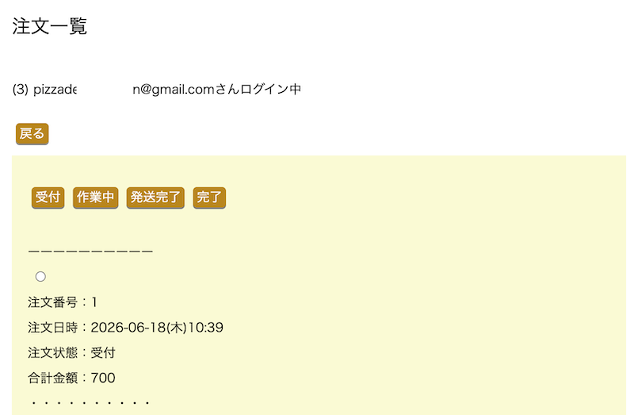
<br><br>
スタッフ管理。

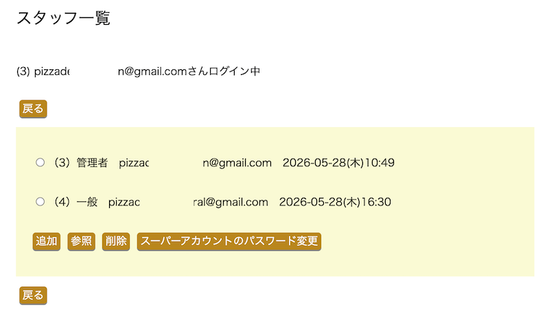

## 開発目的

PHP学習のため、
フレームワークを使用せず
一からECサイトを制作しました。

「セキュリティ」
「保守性を意識した設計」
「データベース設計」

など、学ぶことを目的としています。

## 主な機能

### 顧客

- 会員登録
- ログイン
- 商品一覧
- カート
- 注文
- 注文履歴
- アカウント管理

### 管理者

- 商品管理
- ページ管理
- スタッフ管理
- 顧客管理
- 注文管理
- ログイン履歴管理

## 使用技術

### バックエンド
- PHP 8.3
- MariaDB 10.11.14

### フロントエンド
- HTML5
- CSS3
- JavaScript

### Webサーバー
- Apache 2.4.58

### 開発環境
- Ubuntu 24.04.3-live-server (VirtualBox)
- Composer
- Xdebug
- Visual Studio Code
- Git / GitHub

### 使用ライブラリ
- vlucas/phpdotenv

## セキュリティ

- XSS対策
- バリデーション
- CSRF対策
- ワンタイムトークン
- SQLインジェクション対策
- セッションID再生成
- 連続ログインブロック

##ディレクトリ構成
<details>
<summary>ディレクトリ構成</summary>
<pre>
/myproject/
.
├── composer.json
├── composer.lock
├── images
│   ├── 10.png
│   ├── 11.png
│   ├── 12.png
│   ├── 13.png
│   ├── 14.png
│   ├── 15.png
│   ├── 16.png
│   ├── 1.png
│   ├── 2.png
│   ├── 3.png
│   ├── 4.png
│   ├── 5.png
│   ├── 6.png
│   ├── 7.png
│   └── 8.png
├── public
│   ├── admin
│   │   ├── cancel_order
│   │   ├── err
│   │   ├── index.php
│   │   ├── login
│   │   ├── logout
│   │   ├── manage
│   │   │   ├── customer
│   │   │   ├── index.php
│   │   │   ├── pagecreate
│   │   │   ├── product
│   │   │   │   ├── create
│   │   │   │   ├── delete
│   │   │   │   ├── list.php
│   │   │   │   ├── read
│   │   │   │   └── update
│   │   │   ├── staff
│   │   │   │   ├── create
│   │   │   │   ├── delete
│   │   │   │   ├── list.php
│   │   │   │   ├── read
│   │   │   │   └── update
│   │   │   └── system
│   │   │       ├── admin_email
│   │   │       ├── admin_ip
│   │   │       ├── customer_email
│   │   │       ├── customer_ip
│   │   │       └── index.php
│   │   ├── order
│   │   ├── sales
│   │   └── timeout
│   ├── admin_header.php
│   ├── customer
│   │   ├── err
│   │   ├── his
│   │   │   ├── current
│   │   │   ├── index.php
│   │   │   └── past
│   │   ├── login
│   │   ├── logout
│   │   ├── register
│   │   ├── timeout
│   │   ├── top
│   │   │   ├── cart
│   │   │   ├── cart_in.php
│   │   │   ├── cart_out.php
│   │   │   ├── delivery
│   │   │   ├── index.php
│   │   │   └── top.js
│   │   └── view
│   │       ├── change_email
│   │       ├── change_pass
│   │       ├── edit
│   │       ├── index.php
│   │       └── withdraw
│   ├── customer_header.php
│   ├── footer.php
│   ├── header_footer.css
│   ├── img
│   │   ├── 1.png
│   │   ├── 2.png
│   │   ├── map.png
│   │   ├── piza01.png
│   │   ├── piza02.png
│   │   ├── piza03.png
│   │   ├── piza04.png
│   │   ├── piza05.png
│   │   ├── piza06.png
│   │   ├── pizalogo.png
│   │   └── sample.png
│   ├── index.php
│   ├── info
│   │   ├── privacy.html
│   │   └── usecookie.html
│   ├── initialsetting.css
│   ├── json
│   │   ├── dessert.json
│   │   └── meal.json
│   └── style.css
├── README.md
├── src
│   ├── Admin
│   │   ├── Service
│   │   │   ├── AdminCancelOrder.php
│   │   │   ├── AdminLogin.php
│   │   │   ├── AdminLogout.php
│   │   │   ├── AdminManageCustomer.php
│   │   │   ├── AdminManagePagecreate.php
│   │   │   ├── AdminManageProduct.php
│   │   │   ├── AdminManageStaff.php
│   │   │   ├── AdminManageSystem.php
│   │   │   ├── AdminOrder.php
│   │   │   ├── AdminSales.php
│   │   │   └── AdminTimeout.php
│   │   ├── Token
│   │   │   ├── AdminCsrf.php
│   │   │   └── AdminOneTimeToken.php
│   │   └── Validator
│   │       ├── AdminPostValidator.php
│   │       ├── AdminSessionValidator.php
│   │       └── Database
│   │           ├── AdminLoginEmailRepositoryValidator.php
│   │           ├── AdminLoginIpRepositoryValidator.php
│   │           ├── AdminRepositoryValidator.php
│   │           ├── CustomerLoginEmailRepositoryValidator.php
│   │           ├── CustomerLoginIpRepositoryValidator.php
│   │           ├── CustomerRepositoryValidator.php
│   │           ├── OrderRepositoryValidator.php
│   │           └── ProductRepositoryValidator.php
│   ├── Common
│   │   ├── DisplayDateWeek.php
│   │   ├── ErrLog.php
│   │   ├── Htmlspecialchars.php
│   │   ├── JsonResponse.php
│   │   ├── RedirectPage.php
│   │   └── RegexCheck.php
│   ├── Config
│   │   ├── Database.php
│   │   ├── Env.php
│   │   └── Path.php
│   ├── Constants
│   │   ├── AdminRole.php
│   │   ├── CustomerStatus.php
│   │   └── OrderStatus.php
│   ├── Customer
│   │   ├── Service
│   │   │   ├── CustomerHis.php
│   │   │   ├── CustomerLogin.php
│   │   │   ├── CustomerLogout.php
│   │   │   ├── CustomerRegister.php
│   │   │   ├── CustomerTimeout.php
│   │   │   ├── CustomerTop.php
│   │   │   └── CustomerView.php
│   │   ├── Token
│   │   │   ├── CustomerCsrf.php
│   │   │   └── CustomerOneTimeToken.php
│   │   └── Validator
│   │       ├── CustomerPostValidator.php
│   │       ├── CustomerSessionValidator.php
│   │       └── Database
│   │           ├── CustomerLoginEmailRepositoryValidator.php
│   │           ├── CustomerLoginIpRepositoryValidator.php
│   │           ├── CustomerRepositoryValidator.php
│   │           ├── OrderitemRepositoryValidator.php
│   │           ├── OrderRepositoryValidator.php
│   │           └── ProductRepositoryValidator.php
│   └── Repository
│       ├── AdminLoginEmailRepository.php
│       ├── AdminLoginIpRepository.php
│       ├── AdminRepository.php
│       ├── CustomerLoginEmailRepository.php
│       ├── CustomerLoginIpRepository.php
│       ├── CustomerRepository.php
│       ├── OrderitemRepository.php
│       ├── OrderRepository.php
│       └── ProductRepository.php
├── storage
│   └── trash
│       ├── img
│       └── json
└── vendor
</pre>
</details>

## 工夫した点

以下の3点は、特に意識して実装しました。

１：Repository層とService層の分離
２：セキュリティ対策
３：Session設計

### Repository層とService層の分離

Repository層とService層を分離し、それぞれの責務を明確にしました。

・Repository層：データベースアクセスを担当
・Service層：業務ロジックを担当

責務を分けることでコードの見通しが良くなり、保守性や再利用性を高めています。

設計については試行錯誤を重ね、何度もリファクタリングを行いながら現在の構成に改善しました。

### セキュリティ対策

ECサイトとして基本的なセキュリティ対策を実装しました。

・XSS対策
・CSRF対策
・One-Time tokenによる二重送信防止

・SQLインジェクション対策
・連続ログイン制限

特に連続ログイン制限では、ログイン失敗回数に応じて待機時間が指数的に増加する仕組みを実装しました。

待機時間は （失敗回数 + 1）² 秒で加算され、最大約50秒まで増加します。これにより、ブルートフォース攻撃（総当たり攻撃）への耐性を高めています。

また、失敗回数などの情報はデータベースに保存しているため、将来的には特定のIPアドレスをログイン禁止にする機能なども追加できる設計にしています。

### Sessionの設計

Sessionは用途ごとにデータを分類し、管理しやすい構成にしました。

```php
$_SESSION['customer']['form']
$_SESSION['customer']['cart']
```

このように役割ごとに管理することで、必要なデータだけを取得・削除でき、可読性や保守性の向上につながっています。

## 苦労した点

最も苦労したのは、LAMP環境の構築です。

VirtualBox上のLinuxにApache、PHP、MariaDBを導入し、
開発環境を整えるまでに多くの時間を要しました。

また、開発中にはApacheが www-data ユーザーで動作することを理解しておらず、
ファイルの所有権や権限が原因で問題が発生しました。

これらの経験を通して、
Linuxの権限管理や開発環境の仕組みについて理解を深めることができました。

## テーブル一覧
<pre>
管理者アカウント
+------------------+
| admins           |
+------------------+
| PK id            |
| email            |
| pass             |
+------------------+

顧客アカウント
+------------------+
| customers        |
+------------------+
| PK id            |
| email            |
| pass             |
+------------------+

商品
+------------------+
| products         |
+------------------+
| PK id            |
| name             |
| price            |
+------------------+

注文
+------------------+
| orders           |
+------------------+
| PK id            |
| FK customer_id   |
| status           |
+------------------+

注文明細
+------------------+
| order_items      |
+------------------+
| PK id            |
| FK order_id      |
| FK product_id    |
| quantity         |
+------------------+
</pre>

## ER図
<pre>
+------------------+
| customers        |
+------------------+
| PK id            |
| name             |
| email            |
+------------------+
          │
          │1
          │
          │N
+------------------+
| orders           |
+------------------+
| PK id            |
| FK customer_id   |
| status           |
+------------------+
          │
          │1
          │
          │N
+------------------+
| order_items      |
+------------------+
| PK id            |
| FK order_id      |
| FK product_id    |
| quantity         |
+------------------+
          ▲
          │N
          │
          │1
+------------------+
| products         |
+------------------+
| PK id            |
| name             |
| price            |
+------------------+
</pre>

## 今後追加予定

- PHPUnit
- Docker対応
- Laravel版の制作

## 学んだこと

このプロジェクトを通して、以下の理解を深めることができました。

・PHPによるMVCを意識した設計
・データベース設計
・セキュリティ対策

## 注意

このサイトはポートフォリオ目的です。

実際の商品販売は行っていません。

もしこのコードを使用する場合、入力する個人情報は架空のものをご使用ください。


